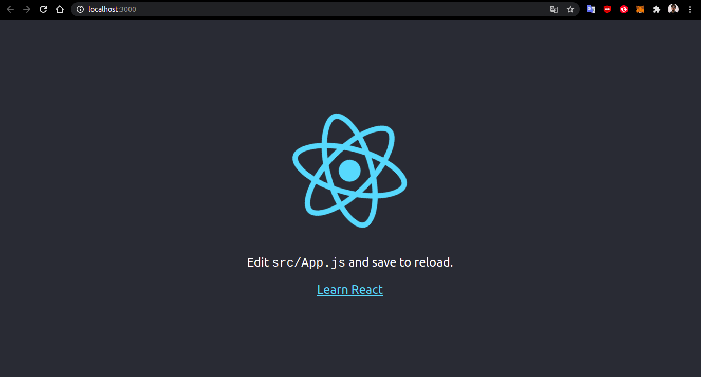
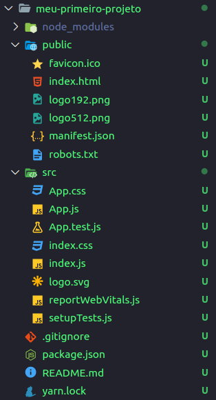
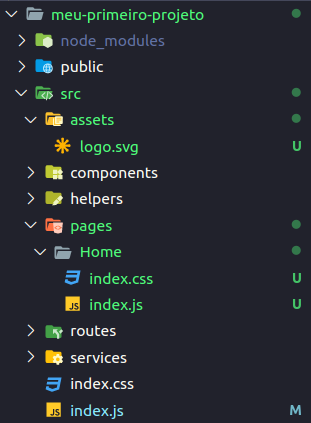
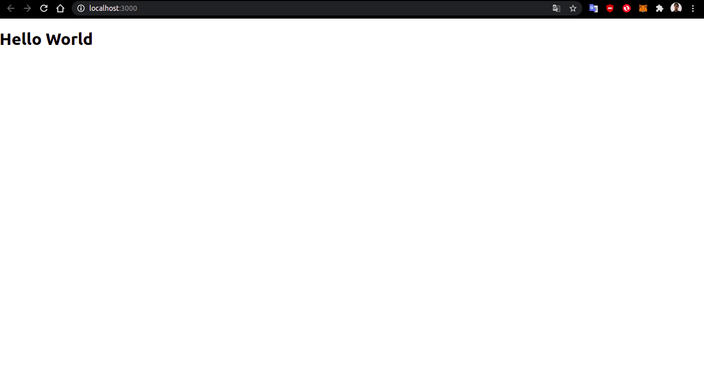
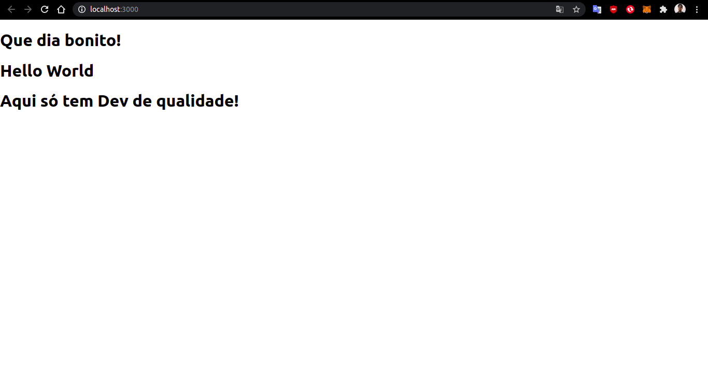

[![Contributors][contributors-shield]][contributors-url]
[![Forks][forks-shield]][forks-url]
[![Stargazers][stars-shield]][stars-url]
[![Issues][issues-shield]][issues-url]
[![MIT License][license-shield]][license-url]

<!-- PROJECT LOGO -->
<br />
<p align="center">
  <a href="https://github.com/SerraZ3/react-js-introducao">
    
  </a>

  <h2 align="center">Introdução ReactJs</h2>

  <p align="center">
    Projeto desenvolvido para aulas
    
    
  </p>
</p>

<!-- TABLE OF CONTENTS -->
<details open="open">
  <summary>Sumário</summary>
  <ol>
    <li>
        <a href="#sobre-o-reactjs">Sobre o ReactJs</a>
        <ul>
            <li><a href="#o-que-é">O que é</a></li>
            <li><a href="#origem">Origem</a></li>
        </ul>
    </li>
    <li>
        <a href="#como-começar">Como começar</a>
        <ul>
            <li><a href="#pré-requisito">Pré-requisitos</a></li>
            <li><a href="#instalação">Instalação</a></li>
        </ul>
    </li>
    <li>
        <a href="#criando-um-projeto-do-zero">Criando um projeto do ZERO</a>
        <ul>
            <li><a href="#criando-projeto">Criando projeto</a></li>
            <li><a href="#rodando-o-projeto">Rodando o Projeto</a></li>
            <li><a href="#estrutura-de-arquivos">Estrutura de arquivos</a></li>
            <li><a href="#hello-world">Hello World</a></li>
        </ul>
    </li>
    <li>
        <a href="#entendendo-o-que-é-um-component">Entendendo o que é um component</a>
        <ul>
            <li><a href="#jsx">JSX</a></li>
            <li><a href="#criando-component">Criando component</a></li>
            <li><a href="#o-que-é-props">O que é props?</a></li>
            <li><a href="#trabalhando-com-props">Trabalhando com props</a></li>
            <li><a href="#o-que-é-state">O que é state?</a></li>
            <li><a href="#trabalhando-com-state">Trabalhando com state</a></li>
            <li><a href="#ciclo-de-vida-de-um-compenent">Ciclo de vida de um component</a></li>
        </ul>
    </li>
    <li><a href="#contribuidores">Contribuidores</a></li>
  </ol>
</details>

## Sobre o Reactjs

### O que é?

O ReactJs é uma biblioteca JavaScript declarativa, eficiente e flexível para a criação de interfaces de usuário (UI)" segundo os criadores.

Desde de seu surgimento vem ganhando popularidade e sua comunidade vem crescendo cada vez mais.

### Origem

Ela foi criado pelo Facebook em 2011 para projetos internos e em 2013 foi aberto para a comunidade. Ela foi desenvolvida para a criação de sites web de forma rápida, escalável e simples. Em seguida ela foi adaptada para aplicações mobile com o surgimento do React-Native, que a partir de um código JavaScript é possível criar uma aplicativo para Android e IOS.

---

## Como começar

### Pré-requisitos

Para começar a aprender é necessário saber algumas linguagens e usar algumas ferramentas para facilitar o aprendizado.

Linguagens:

- Javascript
- JSX (Entender como funciona)
- HTML e CSS (é necessário pois todo o JS será convertido em HTML, CSS e JS no final)

Ferramentas:

- NPM (Node Package Manager, Gerenciador de Pacotes Node)

### Instalação

O ReactJs utiliza o `npm` como gerenciador de pacotes. Com ele é possivel instalar o Reactjs e outros pacotes posteriormente.

Para nosso tutorial utilizaremos as seguintes versões do `node` e `npm`

- node: v14.15.1^
- npm: v6.14.1^

Além disso é necessário instalarmos o `create-react-app` para podermos criar nosso projetinho

### Instalando o create-react-app

Instalando create-react-app com npm:

Para instalar com o npm basta rodar o seguinte comando

```sh
npm install create-react-app -g
```

O que esse comando está fazendo? `npm` é o gerenciador, `install` é o comando do `npm` que diz "Hey, quero instalar um pacote", `create-react-app` é o nome do pacote que quero instalar e `-g` significar "global", ou seja, está dizendo "hey, instalar o pacote X de forma global para que eu sempre possa usar ele"

---

## Criando um projeto do zero

Existem duas formas para criar um projeto em ReactJs.

A primeira forma é usando o `create-react-app` que instalamos anteriormente.

A segunda é usando o `npx`. Ele usa os pacotes do `npm` sem precisar baixá-los. Para usar o `npx` é necessário que a versão do `npm` seja maior que `v5.2`.

Para verificar se o `npx` está instalado na sua máquina rode o seguinte comando:

```sh
npx -v
# Comentário
# saida deve ser a versão do seu npx
# exemplo: 6.14.8
```

### Criando Projeto

**Criando projeto com create-react-app:**

Rode o seguinte comando para criar seu projetinho

```sh
create-react-app nome-projeto
```

Em `nome-projeto` você deve por o nome que será o seu projeto

**Criando projeto com npx:**

Esse comando diferente do anterior, ele não instala as configurações do `create-react-app` na sua máquina, ele busca no banco de dados do `npm` e roda direto na sua máquina

```sh
npx create-react-app nome-projeto
```

### Rodando o projeto

Após criar o projeto é preciso rodar um comando no terminal para que a aplicação inicie. O comando deve ser rodado no raiz (dentro da pasta) do seu projeto criado

```sh
npm start
```

O resultado deve ser esse



**O que está acontecendo aqui?**

O React converte código JavaScript e JSX para HTML, CSS e JavaScript para que o navegador possa entender. Com isso, ao rodar esse comando, estamos criando um servidor que monitora as alterações no seu código e realizar essa conversão e, em seguida, atualiza sua aplicação.

O React roda um servidor no `localhost` (127.0.0.1) da sua máquina na porta 3000. É possivel alterar essa configuração posteriormente.

### Estrutura de arquivos

Como resultado da criação do projeto é criado uma pasta com o nome especificado no parametro `nome-projeto`, nesse exemplo usamos `meu-primeiro-projeto` como nome do projeto. A pasta gerada terá os seguintes arquivos:



O diretório é dividido assim:

- `node_modules` _(Pasta com instalação de pacotes externos)_
- public _(Pasta com configuração html do site)_
  - favicon.ico _(Icone do site)_
  - index.html _(Arquivo com a estrutura base do HTML)_
  - logo192.png _(Logo react)_
  - logo512.png _(Logo react)_
  - manifest.json _(Arquivo que descreve seu app e configura para aplicações mobile)_
  - robots.txt _(Arquivo para robos CEO)_
- src _(Pasta com conteúdo do seu site)_
  - App.css _(Estilo do App.js)_
  - App.js _(Onde fica o código de sua aplicação)_
  - App.test.js _(Arquivo de teste)_
  - index.css _(Estilo de toda sua aplicação)_
  - index.js _(Arquivo que chama o component principal)_
  - logo.svg _(Logo)_
  - reportWebVitals.js _(Verifica performance do seu projeto e outras informações)_
  - setupTests.js _(Configuração para testes)_
- .gitignore _(Diz quais arquivos ou pastas não enviar para o github)_
- package.json _(Configuração do gerenciador de pacotes)_
- README
- yarn.lock (ou package-lock.json) _(Arquivo de configuração)_

Para nossos exemplos iremos usar essa estrutura:



Nessa estrutura não alteramos a pasta `public` e `node_modules`.

_Obs:_ Evite alterar a pasta `node_modules` pois são pacotes que são instalados automaticamente quando criado o projeto e quando se baixa algum módulo externo.

Nossa nova estrutura fica dessa forma:

- src _(Pasta com conteúdo do seu site)_
  - assets _(Pasta para salvar imagens, videos e audios)_
    - logo.svg _(Logo)_
  - components _(Pasta que irá ficar components)_
  - helpers _(Pasta para arquivos que auxiliam no desenvolvimento)_
  - pages _(Pasta para paginas da aplicação)_
    - Home _(Uma página da sua aplicação)_
      - index.js _(Component com a página)_
      - styles.css _(CSS da pagina)_
      - styles.js _(arquivo de estilização da página)_
  - routes _(Pasta para gerenciar rota entre telas)_
  - services _(Pasta para gerenciar comunicação com API)_
  - index.css _(Estilo de toda sua aplicação)_
  - index.js _(Arquivo que chama o component principal)_

Em nosso padrão iremos usar o nome das pastas e arquivos em minúsculo, exceto se for um component.

Nesse caso para que sua aplicação possa rodar nesse formato vamos estar apagando o `reportWebVitals.js`, `setupTests.js` e `App.test.js`.

Passaremos o `logo.svg` de `src/logo.svg` para `src/assets/logo.svg`.

Além disso, iremos passar o conteúdo do arquivo `src/App.js` para o `src/pages/Home/index.js` e do `src/App.css` para o `src/pages/Home/styles.css`

O `src/index.js` e o `src/Home/index.js` terão seu conteúdo alterado, pois alteramos o diretório e nome dos arquivos.

O código fica de cada um fica assim:

```js
// src/index.js
import React from "react";
import ReactDOM from "react-dom";
import "./index.css";
import Home from "./pages/Home";

// ReactDOM renderiza o component dentro do método .render()
ReactDOM.render(
  // React.StrictMode é um ferramenta que sinaliza
  // possíveis problemas na aplicação
  <React.StrictMode>
    <Home />
  </React.StrictMode>,
  // Pega o id do elemento que será renderizado o conteúdo a cima
  document.getElementById("root")
);
```

```js
// src/pages/Home/index.js
import logo from "../../assets/logo.svg";
import "./styles.css";

function Home() {
  return (
    <div className="App">
      <header className="App-header">
        
        <p>
          Edit <code>src/App.js</code> and save to reload.
        </p>
        <a
          className="App-link"
          href="https://reactjs.org"
          target="_blank"
          rel="noopener noreferrer"
        >
          Learn React
        </a>
      </header>
    </div>
  );
}

export default Home;
```

Por enquanto não explicarei o que acontece no `Home` pois veremos mais a frente como criar um component.

_Obs:_ Caso sua aplicação não esteja funcionando após alterar diversas pastas recomendo reiniciar o servidor.

### Hello World

Agora que configuramos o projeto, vamos alterar o `src/pages/Home/index.js` para fazermos um Hello World.

Primeiro verifique que o servidor está rodando. Em seguida abra o arquivo e ponha o seguinte código:

```js
// Nome do component. Lembre-se que ele deve ser sempre com a
// primeira letra maiúscula
function Home() {
  // Um component sempre deve retorna um valor
  // Dentro desse return parece que estamos retornando html,
  // mas na verdade estamos retornando JSX que será posteriormente
  // convertido em HTML, CSS e JS
  return (
    <div>
      <h1>Hello World</h1>
    </div>
  );
}
// Sempre devemos exportar um component após criá-lo para podermos usar fora do arquivo
export default Home;
```

Esse deve ser o resultado final



---

## Entendendo o que é um component

Para criarmos um component é preciso entender um pouco como funciona o JSX

### JSX

JSX significa JavaScript XML, ou seja, é uma linguagem de marcação que tem o objetivo converter um código em outro, nesse caso JSX e JS para HTML. O JSX é bastante semelhante ao HTML.

Exemplo:

```js
// Função JS que retorna um JSX
function Exemplo() {
  return (
    <div>
      <h1>Titulo 1</h1>
      <h2>Titulo 2</h2>
      <h3>Titulo 3</h3>
      <p>Parágrafo</p>
    </div>
  );
}
```

Uma diferença entre o html é que o JSX aceita código JS e possui alguns nomes diferentes para alguns atributos.

A maior das tags html iremos usar da mesma forma no JSX, mas terão algumas que será necessário buscar na documentação como é a sintaxe. Nos exemplos tentaremos usar o máximo possivel, mas como são muitas será necessário buscar fontes externas.

_Atenção!_ Nesse exemplo podemos perceber que usamos JS e JSX no mesmo arquivo .js. Tudo fora do `return` é código JS e o que está dentro é JSX

**Comentário**

```js
function Exemplo() {
  // Comentário em JS
  return (
    <div>
      {/* Comentário em JSX */}
      <h1>Titulo 1</h1>
      <h2>Titulo 2</h2>
      <h3>Titulo 3</h3>
      <p>Parágrafo</p>
    </div>
  );
}
```

**JS no JSX**

Para usar variáveis no JSX devemos seguir o seguinte exemplo:

```js
function Exemplo() {
  const titulo1 = "Titulo 1";
  var titulo2 = "Titulo 2";
  let titulo2 = "Titulo 3";

  return (
    <div>
      <h1>{titulo1}</h1>
      <h2>{titulo2}</h2>
      <h3>{titulo3}</h3>
      <p>Parágrafo</p>
    </div>
  );
}
```

Para conseguir imprimir no JSX é necessário que a variável seja um string, number ou outro objeto JSX. Se for um Array ou Objeto irá gerar erro

É possivel mapear arrays e imprimir diversos elementos de uma vez

```js
function Exemplo() {
  const comprarNoMercado = ["Banana", "Maça", "Leite", "Paçoca"];

  return (
    <div>
      <h1>Lista de compras</h1>
      <ul>
        {
          // Array que iremos mapear
          comprarNoMercado.map((item) => {
            // Para imprimirmos na tela é necessário retornar um JSX ou string
            // Aqui estamos retornando um JSX
            return <li>{item}</li>;
          })
        }
      </ul>
    </div>
  );
}
```

**Style**

A estilização no JSX possui uma sintaxe um pouco diferente do CSS, mas com a mesma lógica. O nome da sintaxe usada é CSS-in-JS

```js
function Exemplo() {
  // Declarando variável de estilização
  const styleH3 = {
    height: "10px",
    backgroundColor: "blue",
    marginBottom: "5em",
    // Ao se colocar o numero sem dizer o tipo de medida
    // Ele automaticamente converte para px
    // 50 => 50px
    marginTop: 50,
  };

  const titulo = {
    color: "red",
    // 10 => 10px
    paddingTop: 10,
    paddingBottom: "10px",
  };
  return (
    <div>
      {/* Estilo direto na tag */}
      <h1 style={{ fontColor: "red" }}>Titulo 1</h1>
      {/* Multiplos estilos em um elemento */}
      <h2 style={{ ...{ backgroundColor: "#606060" }, ...titulo }}>Titulo 2</h2>
      {/* Multiplos estilos em um elemento */}
      <h3 style={{ ...styleH3, ...titulo }}>Titulo 3</h3>
      <p style={{ height: 10 }}>Parágrafo</p>
    </div>
  );
}
```

A conversão da sintaxe do css para a sintaxe do CSS-in-JS funciona assim:

Termos `background-color: blue;` do css, para transformar para CSS-in-JS retiramos o `-`, que une `background` a `color`, e em seguida colocamos a primeira letra da segunda palavra em maiusculo: `backgroundColor`. O valor desse estilo deve vir entre aspas para conseguir ser identificado: `backgroudColor: "blue"`.

Estilos que não são palavras compostas possuem a mesma sintaxe, ex: `height`, `width`, `margin`...

Se desejar saber mais a respeito de estilização basta olhar esse [link da documentação](https://pt-br.reactjs.org/docs/dom-elements.html#style)

**Class**

Para usar classes no React a sintaxe é diferente mas a funcionalidade é a mesma

```js
function Exemplo() {
  return (
    <div className="row">
      <div className="col-12"></div>
      <div className="col-12"></div>
      <div className="col-12"></div>
    </div>
  );
}
```

Ao invés de `class` usammos `className`

### Criando Component

Até o momento viemos criando components

```js
// Esse aqui é o component home
function Home() {
  return (
    <div>
      <h1>Hello World</h1>
    </div>
  );
}

export default Home;
```

De forma resumida podemos dizer que component é uma função que retorna um elemento JSX. Existem diversas formas de criar um component. Iremos mostrar alguns exemplos de como lidar com eles

```js
// Arquivo src/pages/Home/index.js
// Forma padrão de declaração
function Home() {
  return (
    <div>
      <h1>Hello World</h1>
    </div>
  );
}
export default Home;
```

```js
// Arquivo src/pages/Home/index.js
// Através de arrow functions
const Home = () => {
  return (
    <div>
      <h1>Hello World</h1>
    </div>
  );
};
export default Home;
```

```js
// Arquivo src/pages/Home/index.js
// Podemos criar um outro component para melhorar sua reutilização
function Hello() {
  return <h1>Hello World</h1>;
}
function Home() {
  return (
    <div>
      <Hello />
      <Hello />
      <Hello />
    </div>
  );
}
export default Home;
```

```js
// Arquivo src/pages/Home/index.js
// Podemos criar um outro component para melhorar sua reutilização
// Usando arrow functions
const Hello = () => <h1>Hello World</h1>;

function Home() {
  return (
    <div>
      <Hello />
      <Hello />
      <Hello />
    </div>
  );
}
export default Home;
```

Essas são as formas básicas para criar um component. Podemos estar usando components a partir de outros arquivos. Por exemplo:

```js
// Arquivo src/components/Hello/index.js

const Hello = () => <h1>Hello World</h1>;

export default Hello;
```

```js
// Arquivo src/pages/Home/index.js
import Hello from "../../components/Hello";
// Em JS ele pega por padrão o arquivo index.js, então podemos emitir, mas podemos chamar o index também (não recomendo chamar)
// import Hello from "../../components/Hello/index.js";

function Home() {
  return (
    <div>
      <Hello />
      <Hello />
      <Hello />
    </div>
  );
}
export default Home;
```

### O que é props?

Como comentado anteriormente, components são como funções que retornam um JSX, então, assim como funções, ele pode receber parametros. Esse parametros podem ser padrão do component, tipo `style`, `className`... ou podem ser definidos por você.

```js
// Arquivo src/pages/Home/index.js
const ImprimeFrase = (props) => <h1>{props.frase}</h1>;

function Home() {
  return (
    <div>
      {/* 'frase' seria como um parametro de uma função só que na sintaxe JSX */}
      <ImprimeFrase frase={"Que dia bonito!"} />
      <ImprimeFrase frase="Hello World" />
      <ImprimeFrase frase="Aqui só tem Dev de qualidade!" />
    </div>
  );
}
export default Home;
```



### Trabalhando com props

```js
// Arquivo src/pages/Home/index.js
// Podemos usar a desestruturação de objeto para torna o código mais limpo
const ImprimeFrase = ({ frase }) => <h1>{frase}</h1>;
// Basicamente estamos pegando a chave 'frase' do objeto 'props'

function Home() {
  return (
    <div>
      {/* 'frase' seria como um parametro de uma função só que na sintaxe JSX */}
      <ImprimeFrase frase={"Que dia bonito!"} />
      <ImprimeFrase frase="Hello World" />
      <ImprimeFrase frase="Aqui só tem Dev de qualidade!" />
    </div>
  );
}
export default Home;
```

Podemos criar props com diversos tipos de dados com o props, seja array, objeto, number...

```js
// Arquivo src/pages/Home/index.js
// Imprime o objeto produto
const ImprimeProduto = ({ produto }) => (
  <div>
    <h1>{produto.nome}</h1>
    <h1>{produto.preco}</h1>
    <h1>{produto.unidade}</h1>
  </div>
);

function Home() {
  return (
    <div>
      <ImprimeProduto
        produto={{
          nome: "Batata",
          preco: 2.5,
          unidade: 10,
        }}
      />
    </div>
  );
}
export default Home;
```

```js
// Arquivo src/pages/Home/index.js
// Imprime um array de objetos produto
const ImprimeProdutos = ({ produtos }) =>
  produtos.map((produto) => (
    <div>
      <h1>{produto.nome}</h1>
      <h1>{produto.preco}</h1>
      <h1>{produto.unidade}</h1>
      <hr />
    </div>
  ));
const produtos = [
  {
    nome: "Batata",
    preco: 2.5,
    unidade: 10,
  },
  {
    nome: "Limão",
    preco: 13.4,
    unidade: 130,
  },
  {
    nome: "Caju",
    preco: 1.4,
    unidade: 300,
  },
];
function Home() {
  return (
    <div>
      <ImprimeProdutos produtos={produtos} />
    </div>
  );
}
export default Home;
```

```js
// Arquivo src/pages/Home/index.js
// Podemos passar quantos props quisermos
const ImprimeEndereco = ({ rua, bairro, cidade, cep, numero }) => (
  <div>
    <h1>{rua}</h1>
    <h1>{bairro}</h1>
    <h1>{cep}</h1>
    <h1>{numero}</h1>
    <h1>{cidade}</h1>
  </div>
);

function Home() {
  return (
    <div>
      <ImprimeEndereco
        rua={"Rua são josé"}
        bairro="José Santos"
        numero={201}
        cidade="Recife"
        cep="12345-26"
      />
    </div>
  );
}
export default Home;
```

Além disso podemos passar valores vazios que recebem um valor true ou undefined

```js
// Arquivo src/pages/Home/index.js
const ImprimeFrase = ({ frase }) => (
  <div>
    {console.log(frase)}
    <h1>{frase}</h1>
  </div>
);

function Home() {
  return (
    <div>
      {/* frase = undefined */}
      <ImprimeFrase />
      {/* frase = true */}
      <ImprimeFrase frase />
      {/* frase = "Hello World" */}
      <ImprimeFrase frase="Hello World" />
    </div>
  );
}
export default Home;
```

Ou até mesmo definir valor padrão

```js
// Arquivo src/pages/Home/index.js
const ImprimeFrase = ({ frase = false }) => (
  <div>
    {console.log(frase)}
    <h1>{frase}</h1>
  </div>
);

function Home() {
  return (
    <div>
      {/* frase = false */}
      <ImprimeFrase />
      {/* frase = true */}
      <ImprimeFrase frase />
      {/* frase = "Hello World" */}
      <ImprimeFrase frase="Hello World" />
    </div>
  );
}
export default Home;
```

### O que é state?

Se precisarmos alterar o valor de uma variável de acordo com algum evento, após recebermos dados de uma api ou após nosso component ser renderizado não podemos usar os props ou criar uma variável diretamente no código. Para isso existe um conceito/ferramenta chamado state

State, em resumo, seria uma variável que pode atualizar seu valor após seu component ser renderizado. Para isso iremos importar o `useState` do React dessa forma:

```js
// Arquivo src/pages/Home/index.js
import React, { useState } from "react";

function Home() {
  // Essa é a sintaxe de declaração de um state
  // O useState retorna um array com duas posições
  // A primeira é a variável que terá o valor do state
  // A segunda a função que irá alterar esse valor
  const [contador, setContador] = useState(0);
  // Função que pega o valor do state e soma 1
  const incrementa = () => {
    setContador(contador + 1);
  };
  // Função que pega o valor do state e diminui 1
  const decrementa = () => {
    setContador(contador - 1);
  };
  return (
    <div>
      <h1>{contador}</h1>
      {/* Adicionando o evento do click e chamando funções respectivas*/}
      <h1 onClick={incrementa}>Incrementar</h1>
      <h1 onClick={decrementa}>Decrementar</h1>
    </div>
  );
}
export default Home;
```

### Trabalhando com state

O `useState()` é uma função que recebe o valor inicial do state. No exemplo a cima o valor inicial é 0, mas podemos por valores como array, object, number...

```js
// Arquivo src/pages/Home/index.js
import React, { useState } from "react";

function Home() {
  const [compras, setCompras] = useState(["banana", "maça", "pera"]);
  const addAbacaxi = () => {
    let comAbacaxi = compras.concat(["abacaxi"]);
    setCompras(comAbacaxi);
    // Não podemos usar o 'setCompras(compras.push('abacaxi'))'
    // Pois a variável do state não pode ser alterado sem sua função set
    // e o método push altera diretamente o array
  };
  return (
    <div onClick={addAbacaxi}>
      {compras.map((compra) => (
        <h1>{compra}</h1>
      ))}
    </div>
  );
}
export default Home;
```

```js
// Arquivo src/pages/Home/index.js
import React, { useState } from "react";

function Home() {
  const [loading, setLoading] = useState(false);
  const invertLoading = () => {
    setLoading(!loading);
  };
  return (
    <div onClick={invertLoading}>
      {loading ? <h1>carregando...</h1> : <h1>carregado</h1>}
    </div>
  );
}
export default Home;
```

---

## Contribuidores

- [Henrique Serra](https://github.com/SerraZ3)

[contributors-shield]: https://img.shields.io/github/contributors/SerraZ3/react-js-introducao.svg?style=for-the-badge
[contributors-url]: https://github.com/SerraZ3/react-js-introducao/graphs/contributors
[forks-shield]: https://img.shields.io/github/forks/SerraZ3/react-js-introducao.svg?style=for-the-badge
[forks-url]: https://github.com/SerraZ3/react-js-introducao/network/members
[stars-shield]: https://img.shields.io/github/stars/SerraZ3/react-js-introducao.svg?style=for-the-badge
[stars-url]: https://github.com/SerraZ3/react-js-introducao/stargazers
[issues-shield]: https://img.shields.io/github/issues/SerraZ3/react-js-introducao.svg?style=for-the-badge
[issues-url]: https://github.com/SerraZ3/react-js-introducao/issues
[license-shield]: https://img.shields.io/github/license/SerraZ3/react-js-introducao.svg?style=for-the-badge
[license-url]: https://github.com/SerraZ3/react-js-introducao/blob/main/LICENSE
